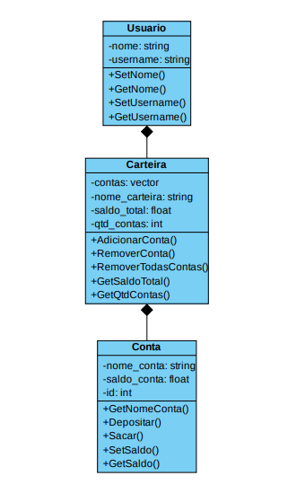

# MinhasFinancas

## Sistema de gerenciamento de contas

### Funcionalidades do sistema:
- Criação de diferentes contas
- Opção de adicionar receitas ou despesas
- Possibilidade de ver o saldo de cada conta ou de todas as contas da carteira
- Possibilidade de ver a quantidade de contas na carteira do usuário
- Possibilidade de editar os dados do usário

### Funcionalidades a serem implementadas:
- Histórico de transações
- Transferência entre carteiras
- Entre outras

**Diagrama de Classes:**

  

